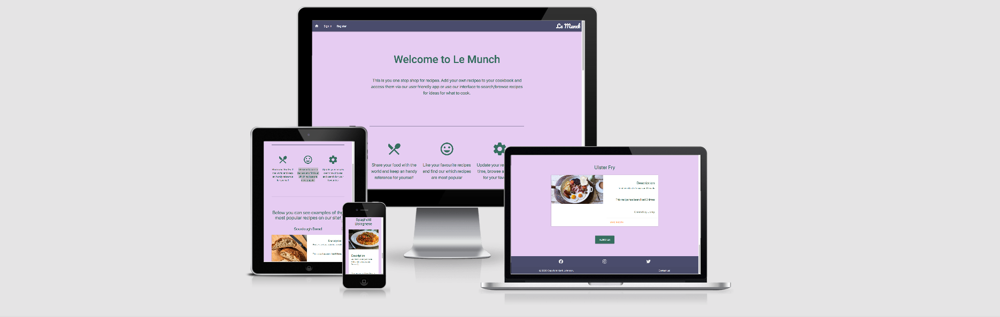
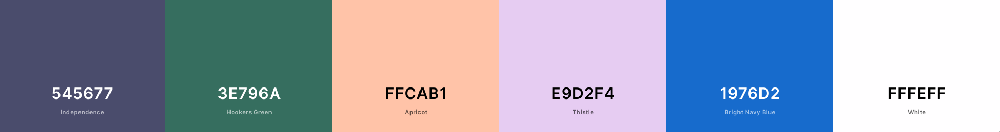
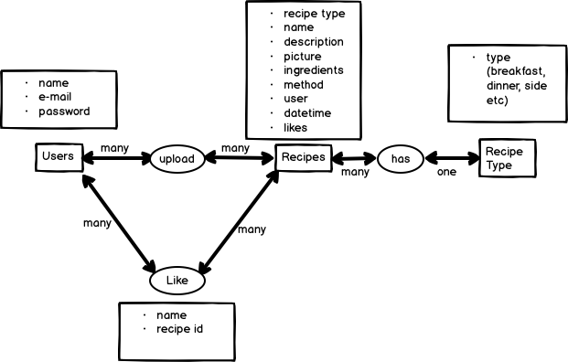
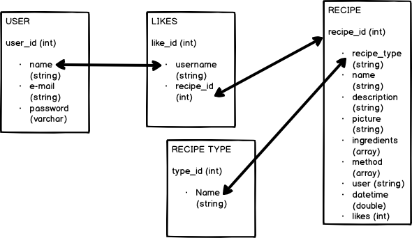

<h1>Le Munch</h1>

Le Munch is here to help you decide what to have for your next meal!  You can upload your own recipes so you have your own online cookbook and
search and browse through other users recipes to give you ideas of what to cook.  Develop your love of food by deep diving on food pics and you
can like recipes to show your support for the food you like and to help other users find the most popular dishes on the site.

To go to the live site click [here](http://le-munch-flask-markjohnston.herokuapp.com/)

# UX

## User Stories

There will be 2 main user types and the user types are not mutually exclusive.  The same user could fall into both categories dependent on the their behaviour.

The uploader user will be the primary content creators and will produce the recipes for the site.  Their goal is to show off what they can do and see how popular their recipes are.

- As an uploader I want to upload a recipe so that other users can see if for inspiration about their own meals and so that I have a record for my online cookbook.

- As an uploader I want functionality to upload a photo to so that users are enticed to read my recipes.

- As an uploader I want to be able to edit and delete recipes so that I can customise my online cookbook to suit my ongoing needs.

- As an uploader I want other users to be able to ‘upvote’ or ‘like’ my recipes so that I can understand how popular they are.

- As an uploader I want to be able to add, edit the type of recipe so that other users easily can browse the right category to find recipes to suit their needs.

The browser user will be mainly focused on looking at recipe pictures and recipe content.  They can give their approval to recipes through ‘likes’ or ‘upvotes’ and are mainly there to find inspiration for what to cook or look at nice food pictures.

- As a browser I want to be able to browse by recipes ranked by likes so that I can see the most popular recipes to get inspiration about what to cook.

- As a browser I want to be able to sort the browsed recipes by newest so that I can see the latest recipes on the site and not just htose I've seen before.

- As a browser I want to be able to search by recipes so that I can find my favourite recipes to see how other cooks do them.

Site owner goal

- As site owner I want to create a welcome space for users to connect over food and develop their love of cooking.

See separate Testing.md file for information on how these user stories were tested [here](testing/testing.md)

## Wireframes

Basic wireframes for this project were created using Balsamiq below is a link to show

[Wireframes Pictures Repository](https://github.com/markj0hnst0n/LeMunch/tree/master/readme/wireframes)

## Colour Scheme

I used the coolors site to generate a colour scheme based on a dark purple the base colour.  I liked that the deep colour matched the colour
of an aubergine as it's a favourite vegetable of mine and my wife.  Purple is also our eldest daughter's favourite colour so it made sense to use it as a starting point.

The green used for a lot of text is dark to make it more readable against the pink background for visually impaired users also black #000000 was used for form elements too to increase readbility for these users.

The orange used is to make link text more readable against the white background used for the recipe cards.

Blue is used for the cancel buttons and some fo the buttons are a lighter green as accent colours.

[Coolors](https://coolors.co/)

### Features

#### Navbar

- Easily navigate the website via the navbar.

#### Sign up or Login

- Sign Up / Sign In to the website so that a unique user is created or their unique profile is added.

#### Edit Profile

- Edit user info.

#### Profile page

- Use the tabs to navigate easily once a user is logged in.

#### Recipe upload

- Add/upload recipes.

#### Browse

- Browse my recipes and recipes of other users.  Sorting by number of likes or unsorted.  Also browse users.

#### Search function

- Search for my favourite recipe.

#### View Recipe

- Shows all the relevant information of a recipe for a browser.

#### Like/Upvote

- Upvote/like recipe.  Each user can only like a recipe once.

### Features not implimented

Next steps for the project:

- Admin user to edit categories and have more control over the user database.  This can be done by direct database access at the moment but accessibility of these functions in the app is desireable
- User profile page
- The ability to search for users
- Connect with users (follow/friend function)

# Technologies Used

[HTML5](https://en.wikipedia.org/wiki/HTML5)
for the structure of the website

[CSS 3](https://en.wikipedia.org/wiki/Cascading_Style_Sheets#CSS_3)
for the look of the website

[Flask Web Framework](https://flask.palletsprojects.com/en/1.1.x/)
framework for the back end application to connect database to front end web page.

[Mongo DB](https://www.mongodb.com/)
for database storage.

[Python 3 Language](https://www.python.org/)
to write code for data manipulation at the back end of the app within the flask framework.

[Materialize](https://materializecss.com/)
website framework with html, css and javascript.

[Fontawesome](https://fontawesome.com/)
for icons.

[Javascript](https://en.wikipedia.org/wiki/JavaScript)
for the logic of the game.  To manipulate the HTML and CSS on the screen.

[jQuery](https://en.wikipedia.org/wiki/JQuery)
to manipulate the HTML and CSS on the screen.

[JShint](https://jshint.com/)
to validate javscript code.

[Coolors](https://coolors.co/)
for help with colours and colours scheme.

[Post Images](https://postimages.org/)
to allow users to upload photos and get addresses for their pictures.

[Webformatter](https://webformatter.com/)
for formatting HTML, CSS and javascript code.

[Asana](https://asana.com/)
for project management

[Balsamiq Wireframes](https://balsamiq.com/wireframes/)
for creating Wireframes for initial visual development

[Gitpod](https://www.gitpod.io/)
for writing and testing code.

[GitHub](https://github.com/)
for storing code.

[Google Fonts](https://fonts.google.com/)
for fonts used in the project.

[Google Chrome Development Tools](https://developers.google.com/web/tools/chrome-devtools) for testing code on various device sizes during development and debugging.

[Amazon Web Services](https://aws.amazon.com/) Simple Email Service for STMP mail server.

[Google Lighthouse](https://developers.google.com/web/tools/lighthouse) for testing code health, accessibility, speed and search engine optimisation.

# Information Architechture

The project required a non-relational database and Mongo db was recommended to use so the project was written using it to store the required data.

## Conceptual Database Design

Below is a representation of the data prior to adding to database.

In the diagram below you can find the collections required with information on each key:value pair's title, key and value data type.

Below are the collections required for the project with information on each key:value pair's title, key and value data type.

## Users Collection

|   Description	|  Key	| Data Type |
|---------------|-------|-----------|
| Document ID as generated by mongo db | _id | ObjectId
| Users chosen username | username | String
| The users email address | email | String
| Users choses password | password | String (hashed and salted using werkzeug security)

## Recipe Collection

|   Description	|  Key	| Data Type |
|---------------|-------|-----------|
| Document ID as generated by mongo db | _id | ObjectId
| The type of recipe the user has chosen for the document | recipe_type | String
| Users chosen recipe name | name | String
| A short description of the recipe | description | String
| A picture URL as chosen by the user.  Input validation makes sure it is a valid picture URL
This maybe be left blank and the app will input a filler picture | picture | String
| The ingredients for the recipe | ingredients | Array
| The method steps for the recipe | method | Array
| The user who uploaded the recipe | user | String
| A date/timestamp when the recipe was uploaded | datetime | Double
| The number of the likes the recipe currently has | likes | Int32

## Likes Collection

|   Description	|  Key	| Data Type |
|---------------|-------|-----------|
| Document ID as generated by mongo db | _id | ObjectId
| The name of the user who has initiated the like | username | String
| The id of the recipe which has been liked | recipe_id | ObjectId

## Recipe Types Collection

|   Description	|  Key	| Data Type |
|---------------|-------|-----------|
| Document ID as generated by mongo db | _id | ObjectId
| The category that best describes the recipe | type_name | String

## Logical Data Model

Below is a representation of how the data will be stored in collections and which collections relate to each other.  The arrows denote the links between
collections that are used in the flask app.

## Security considerations

An env.py file was used to store all environment variables and all sensitive information.  HTML form valiation was used to ensure user input was handled in a secure fashion
including regex statement for pictures to make sure that a correct picture URL was used.

# Testing

See separate Testing.md file [here](testing/testing.md)

# Deployment

## Using Heroku

Github address for the project: https://github.com/markj0hnst0n/LeMunch

1. Create a requirements.txt file so that Heroku knows which dependencies to install to ensure the app works correctly.  This can be done by using the command “pip3 freeze —local > requirements.txt on the command line interface.

2. You must have a procfile the ensure Heroku knows which file runs the app and how to run it this can be done by using the command “echo web: python app.py > Procfile”.  Check the file was created correctly and make sure there is no blank line at the bottom.  It should only have 1 line.

3. Make sure the Procfile and requirements.txt are pushed to git.

4. An SMTP server must be used to use to send and receive contact emails from the app.  I have used Amazon Simple Email Service with 2 verified email addresses, one for sending the email and one for receiving it.  You will need to check the security that the type of security the email server uses there are 2 types SSL or TLS and the type of security dictates which port you should use.  You will also have to amend the app config vars on lines 32 and 33 accordingly depending on security system used.

5. You must also have an account with MongoDB, a database and the relevant names must be used to connect to the database collections as shown in lines 41 - 44 of the app.py file.

6. Log in to or create a Heroku account and create a new app by clicking ‘New’ then ‘Create New App’ then choose a name and the relevant region for the app.

7. On the app page click the ‘Settings’ tab and then the ‘Reveal Config Vars’ button and the following variables need to be set as key value pairs:

|   KEY	|  VALUE    |
|-------|-------|
IP | 0.0.0.0 |
PORT | 5000 |
DEBUG_VALUE | FALSE |
MONGO_URI | &lt;your MongoDB connection string&gt; |
MAIL_SERVER | &lt;your STMP email server&gt; |
MAIL_PORT | 587 if the mail server uses TLS and 465 if the mail server uses SSL security |
MAIL_USERNAME | Username to log into chosen SMTP server |
PASSWORD | Password to log into chosen SMTP server |
RECIPIENT | E-mail address to receive contact email |
SENDER | E-mail address to send contact email |
SECRET_KEY | &lt;your STMP email server&gt; |

8. Click the ‘Deploy’ tab and in the ‘Deployment Method’ section select GitHub then search for markj0hnst0n/LeMunch by markj0hnst0n.

9. In the ‘Automatic deploys’ section click on the ‘Enable Automatic Deploys’ button the in the ‘Manual deploy’ section click the ‘Deploy Branch’ button as long as ‘master’ is the selected branch.

10. Once the app has been successfully built you should receive a message saying ‘Your app was successfully deployed’ you can then click on the ‘View’ button or the ‘Open app’ button at the top of the page to go to the deployed app.

## Run Locally

In the GitHub Repository from the project (https://github.com/markj0hnst0n/LeMunch)

1. Click Clone or Download
2. Copy Git URL from the dialogue box
3. Open your developement editor of choice and open a terminal window in a directory of your choice
4. Use the 'git clone' command in terminal followed by the copied git URL (make sure Command Line Developer Tools is installed)

        git clone https://github.com/markj0hnst0n/LeMunch.git

5. A clone of the project will be created locally on your machine so go to the folder in your chosen IDE.
6. Install the necessary dependencies with using the following command

        pip3 install -r requirements.txt

7. Create a file called *env.py* in the project's root directory

8. In your *env.py* file, import the *os* module and set the following environment variables as follows.

    NOTE: Wherever text is surrounded by <> (angle brackets), you will need to provide your own values without the angle brackets as determined by your *MongoDB account*, *mail server* and *secret key*.

    NOTE: Remember to change the *username*, *password* and *cluster_name* in your MongoDB Atlas connection string. Information on getting your *MongoDB Atlas connection string* can be found [here](https://docs.atlas.mongodb.com/tutorial/connect-to-your-cluster/).

        import os

        os.environ['IP'] = "0.0.0.0"
        os.environ['PORT'] = "5000"
        os.environ['MONGO_URI'] = "<your MongoDB URI string>"
        os.environ['SECRET_KEY'] = "<your secret key>"
        os.environ['MAIL_SERVER'] = "<your STMP email server>"
        os.environ['MAIL_USERNAME'] = "Username to log into chosen SMTP server"
        os.environ['MAIL_PASSWORD'] = "Password to log into chosen SMTP server"
        os.environ['SENDER'] = "<E-mail address to send contact email>"
        os.environ['RECIPIENT'] = "<E-mail address to receive contact email>"
        os.environ['MAIL_PORT'] = "587 if the mail server uses TLS and 465 if the mail server uses SSL security"
        os.environ['DEBUG_VALUE'] = "FALSE"

9. In the command line use the following command:

        python3 app.py

10. The app should now be running at: http://0.0.0.0:5000

# Credits

## Content

Written content by Mark Johnston

## Media

All media is user generated and the responsibility of the user.  If copyright is breached please use the contact form to get in touch and we can remove any offending content.

## Influences

User Authentication via session

https://github.com/MiroslavSvec/DCD_lead

Adding input fields dynamically using jquery

https://www.sanwebe.com/2013/03/addremove-input-fields-dynamically-with-jquery

Flask mail

https://pythonhosted.org/Flask-Mail/

Debugging contact form emails

https://stackabuse.com/how-to-send-emails-with-gmail-using-python/

Preloader using javascript and css

https://www.kingsubash.com/simple-page-preloader-with-css-and-javascript

Converting an array to lowercase

https://stackoverflow.com/questions/1801668/convert-a-python-list-with-strings-all-to-lowercase-or-uppercase

## Acknowledgements

Thanks to the following people for making the project happen:

- My Mentor Can Suncullu for his advice, patience and motivation.
- The [Code Institute](https://codeinstitute.net/) Slack Community.
- The [Code Institute](https://codeinstitute.net/) tutors and instructional material.  Espcially tutor Johann for his help with the like functionality.
- My Wife Joanna Johnston for her (constructive) criticism and understanding when I lock myself away in the attic for hours on end

## Disclaimer

This site is intended for educational purposes only, and is not intended for use in any other capacity.